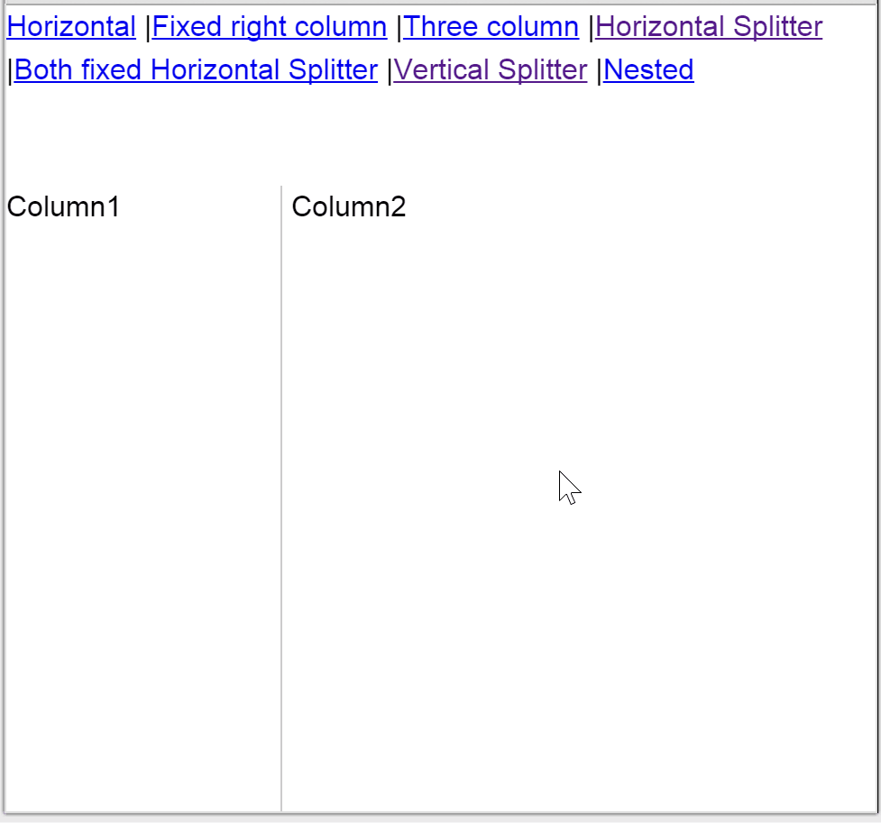

## react-flex-layout
react-flex-layout combines ideas from [react-split-pane](https://github.com/tomkp/react-split-pane) and [react-layout](https://github.com/jsdf/react-layout) into a single project which has good browser compatibility

### Usage
```
<Layout fill='window'>
  <Layout layoutWidth='flex'>Column1</Layout>
  <Layout layoutWidth={100}>Column2</Layout>
</Layout>
```

This will work as expected, the outer layout will fill the browser window exactly, the right panel will be fixed at 100px and the left panel will fill the rest. As the browser is resized the layouts will update.

If you want to allow the user to resize it is as simple as dropping a `<LayoutSplitter />` between the panels
```
<Layout>
  <Layout layoutWidth={100}>Column1</Layout>
  <LayoutSplitter />
  <Layout layoutWidth='flex'>Column2</Layout>
</Layout>
```



### Compatibility
 - Chrome
 - FireFox
 - Internet explorer ? (untested...)
